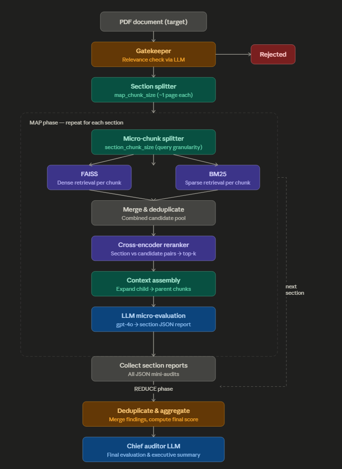

# Lytrex


Lytrex is an end-to-end intelligent system designed to automate and scale cybersecurity compliance auditing across enterprise documents.

It leverages advanced **Retrieval-Augmented Generation (RAG)**, combined with hierarchical document processing and a multi-stage reasoning pipeline, to evaluate organizational policies against regulatory frameworks such as **NCA**, **SAMA**, and **ECC**.

---

## System Overview

Lytrex is a structured AI auditing engine that:

- Processes large enterprise documents (50+ pages)
- Retrieves relevant regulatory controls with high precision using hybrid BM25 + FAISS retrieval
- Performs deep contextual analysis and reasoning
- Generates structured, traceable audit reports
- Produces a final compliance score with actionable recommendations

---

## Core System Capabilities

### 1. Intelligent Compliance Mapping

- Maps company policies to specific regulatory controls
- Uses semantic understanding (dense retrieval) combined with exact keyword matching (BM25) for maximum coverage

### 2. Scalable Document Processing

- Handles large documents using a **Map–Reduce** architecture
- Sections are split into micro-chunks for retrieval granularity, then re-assembled for LLM evaluation
- Ensures full document coverage while preserving context

### 3. High-Precision Hybrid Retrieval

Three-stage retrieval pipeline per section:

1. **Micro-chunking** — each section is split into small query chunks
2. **Hybrid retrieval** — both FAISS (dense) and BM25 (sparse) are run per micro-chunk, candidates are merged and deduplicated
3. **Cross-encoder re-ranking** (BGE) — the full section is scored against all candidates to select top-k

This achieves strong recall (nothing missed) and high precision (only relevant controls surfaced).

### 4. Advanced Reasoning Engine

Performs:

- Policy validation
- Violation detection
- Recommendation generation

Ensures consistent and deterministic analysis.

### 5. Structured and Verifiable Outputs

- Produces strictly formatted **JSON outputs**
- Enforces traceability through explicit references:
  - Page number
  - Section number
  - Framework control ID

---

## System Architecture (High-Level)



Lytrex operates through a layered architecture:

| Layer | Description |
|---|---|
| **1. Document Ingestion Layer** | Processes compliance frameworks (JSON or PDF) and company documents |
| **2. Retrieval Layer** | Micro-chunking, hybrid FAISS+BM25 search, deduplication, and cross-encoder re-ranking |
| **3. Reasoning Layer** | Contextual evaluation and per-section audit generation |
| **4. Aggregation Layer** | Deduplicates and merges section-level reports into a final consolidated result |

---

## Why Lytrex

Traditional compliance auditing is:

- Manual
- Time-consuming
- Inconsistent

Lytrex transforms this process into something that is:

- **Automated**
- **Scalable**
- **Consistent**
- **Explainable**

---

## Key Design Principle

> Accurate compliance auditing requires both **retrieval precision** and **reasoning depth**.

Lytrex achieves this through:

- **Hybrid retrieval (BM25 + FAISS)** — for broad coverage, both semantic and keyword-exact
- **Cross-encoder re-ranking** — for contextual precision at the section level
- **Hierarchical chunking** — for context preservation (child chunks for retrieval, parent chunks for LLM)
- **Map–Reduce architecture** — for scalability across large documents

---

# Transition to Technical Details

The following sections describe the full technical architecture and implementation details of the Lytrex system.

---

# 1. Core AI Models

- **LLM (Reasoning Engine):** `gpt-4o` (OpenAI)  
  Configured with `temperature = 0` and `seed = 42` to ensure deterministic outputs and eliminate hallucinations, enabling precise, rule-based compliance analysis.

- **Embedding Model (Semantic Encoder):** `text-embedding-3-large` (OpenAI)  
  Transforms regulatory framework sections into high-dimensional (3,072-d) vector representations for semantic retrieval.

- **Re-ranking Model (Relevance Scorer):** `BAAI/bge-reranker-base`  
  A local Cross-Encoder that evaluates full section–candidate pairs to refine retrieval based on deep contextual relevance.

- **Sparse Retriever:** `BM25Okapi` (rank_bm25)  
  Keyword-based retrieval run in parallel with FAISS. Catches exact control IDs, regulation numbers, and terminology that dense embeddings may miss.

---

# 2. Retrieval Pipeline (Three-Stage Architecture)

### Vector Database

**FAISS** (Facebook AI Similarity Search) — fully local vector store enabling fast similarity search without external API calls.

**BM25 index** — built in-memory at runtime over all child chunks in the FAISS docstore.

### Stage 1 — Micro-chunk Query Generation

Each section of the target document (`map_chunk_size`, ~1 page) is further split into micro-chunks (`section_chunk_size`, ~200 chars) to act as fine-grained retrieval queries. This increases retrieval granularity without reducing the context passed to the LLM.

### Stage 2 — Hybrid Retrieval (per micro-chunk)

For each micro-chunk:
- **FAISS** retrieves top `k × 2` candidates by vector similarity
- **BM25** retrieves top `k × 2` candidates by keyword overlap

All candidates across all micro-chunks are merged into a single pool and deduplicated by content.

### Stage 3 — Cross-Encoder Re-ranking

The **full section** (not the micro-chunk) is used as the query to score every candidate in the deduplicated pool. The BGE cross-encoder selects the **top-k** most contextually relevant results for LLM evaluation.

---

# 3. Hierarchical Document Processing Strategy

To mitigate the *"Lost in the Middle"* problem, the system uses **multi-level chunking** via `RecursiveCharacterTextSplitter`:

- **Child Chunks (~500 chars):**  
  Optimized for high-precision vector retrieval and BM25 indexing (stored in FAISS docstore).

- **Parent Chunks (~2,500 chars):**  
  Full-context framework sections passed to the LLM.  
  Attached via metadata (`doc.metadata["parent_content"]`) to preserve semantic completeness.

- **Map Chunks (`map_chunk_size`, ~500 chars default):**  
  Sections of the target company document (~1 page each), the unit of LLM micro-evaluation.

- **Micro-chunks (`section_chunk_size`, ~200 chars default):**  
  Fine-grained sub-splits of each map chunk, used exclusively as retrieval queries for BM25 and FAISS.

---

# 4. Auditing Architecture (Map–Reduce Pipeline)

Designed to scale across large enterprise documents (50+ pages).

## MAP Phase (Section-Level Analysis)

For each section of the target document:

1. Split the section into micro-chunks (`section_chunk_size`)
2. Run FAISS and BM25 retrieval on each micro-chunk (top `k × 2` each)
3. Merge all candidates across micro-chunks; deduplicate by content
4. Cross-encoder scores every candidate against the **full section**; select top-k
5. Expand each top-k child chunk to its full parent chunk for context
6. Pass the assembled context + section to `gpt-4o` for structured JSON micro-audit

## REDUCE Phase (Global Synthesis)

1. Collect all section-level JSON reports into a single array
2. Pass to `gpt-4o` acting as *Chief Auditor*
3. Deduplicate violations and compliant areas across sections
4. Compute and return a consolidated **final compliance score** and executive summary

---

# 5. Output Engineering & Reliability

- **Structured Output Enforcement:**  
  `JsonOutputParser` (LangChain) ensures strictly valid JSON responses, eliminating free-form text.

- **Traceability Mechanism:**  
  Prompts enforce explicit citation of evidence using `[Company Page: X | Company Section: Y | Framework Control: Z]`, ensuring all findings are verifiable and grounded.

- **Gatekeeper (Relevance Check):**  
  Before auditing, the first page of the uploaded document is evaluated by the LLM to confirm it is a corporate policy or procedure. Irrelevant documents (menus, articles, etc.) are rejected with a reasoning explanation before any retrieval or auditing occurs.

---

# 6. End-to-End Workflow (Detailed Example)

**Input:** A 60-page company cybersecurity policy document (PDF) + NCA compliance framework (JSON).

---

## Step 1 — Framework Ingestion

- The framework JSON is parsed into structured sections
- Each section's text is split into child chunks (~500 chars) → embedded with `text-embedding-3-large` → stored in FAISS
- Each child chunk carries `parent_content` metadata (~2,500 chars) for context expansion at retrieval time
- A BM25 index is built over all child chunks at runtime

---

## Step 2 — Company Document Chunking

- The 60-page PDF is split into sections (~500 chars each, `map_chunk_size`)
- Each section represents ~1 page or a logical policy block

---

## Step 3 — MAP Phase (Per Section)

**Example: Section covering Access Control Policy**

1. **Micro-chunk split:**  
   The ~500-char section is split into micro-chunks (~200 chars each)

2. **Hybrid retrieval (per micro-chunk):**  
   - FAISS returns top `k × 2` candidates by semantic similarity  
   - BM25 returns top `k × 2` candidates by keyword match  
   - All candidates are merged and deduplicated

3. **Cross-encoder re-ranking:**  
   Full section vs. every deduplicated candidate → top-k selected

4. **Context expansion:**  
   Each top-k child chunk is replaced with its full parent section (~2,500 chars)

5. **LLM micro-evaluation:**  
   Section + assembled framework context passed to `gpt-4o`

6. **Output (mini audit report):**

```json
{
  "internal_audit_reasoning": "Checked [Company Section: 2.1]. Framework Control AC-03 requires least privilege. Company document states all employees receive global admin rights by default — direct contradiction. Found violation.",
  "compliance_score": 75,
  "executive_summary": "Section 2.1 outlines access control policy. While MFA is required for login, the policy critically fails least-privilege mandates by granting global admin rights to standard users.",
  "compliant_areas": [
    "[Company Page: 7 | Company Section: 2.1 | Framework Control: AC-01] Successfully requires MFA for all initial system logins."
  ],
  "violations": [
    "[Company Page: 7 | Company Section: 2.1 | Framework Control: AC-03] Fails to enforce least privilege — standard employees receive global admin rights by default (-25 pts)."
  ],
  "recommendations": [
    "[Company Page: 7 | Company Section: 2.1 | Framework Control: AC-03] Rewrite policy to mandate Role-Based Access Control (RBAC) with minimum required permissions per role."
  ]
}
```

---

## Step 4 — Iterate Across All Sections

- Repeat Step 3 for all sections of the document
- Each produces an independent JSON mini-audit

---

## Step 5 — REDUCE Phase

1. Combine all mini-reports into one array: `[report_1, report_2, ..., report_N]`
2. Pass to `gpt-4o` (Chief Auditor prompt):
   - Deduplicate violations and compliant areas
   - Merge overlapping findings
   - Compute final weighted compliance score

---

## Step 6 — Final Output

```json
{
  "final_compliance_score": 78,
  "master_executive_summary": "The organization demonstrates a baseline commitment to cybersecurity, particularly in MFA and AES-256 encryption at rest. However, systemic vulnerabilities exist in Access Control and Incident Response. The failure to enforce least privilege presents a high-risk contradiction to NCA framework requirements.",
  "all_compliant_areas": [
    "[Company Page: 7 | Company Section: 2.1 | Framework Control: AC-01] MFA required for all system logins.",
    "[Company Page: 22 | Company Section: 4.3 | Framework Control: DS-04] Data at rest encrypted using AES-256.",
    "[Company Page: 45 | Company Section: 8.1 | Framework Control: HR-02] Annual security awareness training mandated."
  ],
  "all_unique_violations": [
    "[Company Page: 7 | Company Section: 2.1 | Framework Control: AC-03] Least privilege not enforced — global admin rights granted by default (-15 pts).",
    "[Company Page: 31 | Company Section: 5.4 | Framework Control: IR-02] No defined timeframe for reporting critical incidents to authorities (-7 pts)."
  ],
  "master_recommendations": [
    "Overhaul Access Control policy (Page 7) to mandate RBAC with minimum required permissions.",
    "Update Incident Response playbook (Page 31) to include a strict 24-hour reporting window for critical breaches."
  ]
}
```

---

# 7. Why This Works (Key Insights)

| Component | Role |
|---|---|
| **BM25** | Catches exact control IDs and terminology — never misses a numbered rule |
| **FAISS (dense)** | Catches conceptually related controls even when wording differs |
| **Cross-encoder** | Precision filter — scores full section vs candidate, not just embedding similarity |
| **Parent chunking** | Preserves full regulatory context for LLM; child chunks are retrieval-only |
| **Micro-chunking** | Increases retrieval surface area per section without reducing LLM context quality |
| **Map–Reduce** | Scales to 50+ page documents without context window overflow |

---

# 8. Experimental Directions

- **Chunk Tuning:**  
  Experiment with:
  - `parent_chunk_size`: 2000–4000  
  - `child_chunk_size`: 400–800  
  - `map_chunk_size`: 400–1000  
  - `section_chunk_size`: 200–600 (larger = richer BM25/FAISS queries, lower granularity)  
  Optimize for balance between retrieval coverage and precision.

- **Re-ranking Improvements:**  
  Try stronger models (`bge-reranker-large`, `monoT5`) and increase the candidate pool (`k × 2` → `k × 3` or more).

- **Model Exploration:**  
  Test different embeddings (`nomic-embed-text`, `bge-large-en`, `e5-mistral`) and LLMs (GPT-4o-mini for cost, Qwen, LLaMA) for accuracy vs. cost tradeoffs.

- **Evaluation:**  
  Track `Recall@k`, precision, F1 against a human-audited ground truth, and LLM consistency across runs.

- **Advanced Ideas:**  
  Query expansion before retrieval, hierarchical retrieval (domain → section → control), caching retrieved controls for repeated violations across sections.